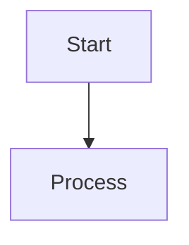

# How to Use Mermaid in README.md

## Flowchart Directions

TD or TB - Top to Bottom
LR - Left to Right
RL - Right to Left
BT - Bottom to Top

## Node Shapes
- A[Rectangle]           - Square box
- B(Rounded)             - Rounded edges
- C([Stadium])           - Pill shape (start/end)
- D[[Subroutine]]        - Double border
- E[(Database)]          - Cylinder shape
- F((Circle))            - Circle
- G>Asymmetric]          - Flag shape
- H{Diamond}             - Decision
- I[/Parallelogram/]     - Input/Output
- J[\Parallelogram\]     - Alt parallelogram

## Connecting Nodes

A --> B                - Arrow
A --- B                - Line
A -.-> B               - Dotted arrow
A ==> B                - Thick arrow
A -->|Label| B         - Labeled arrow